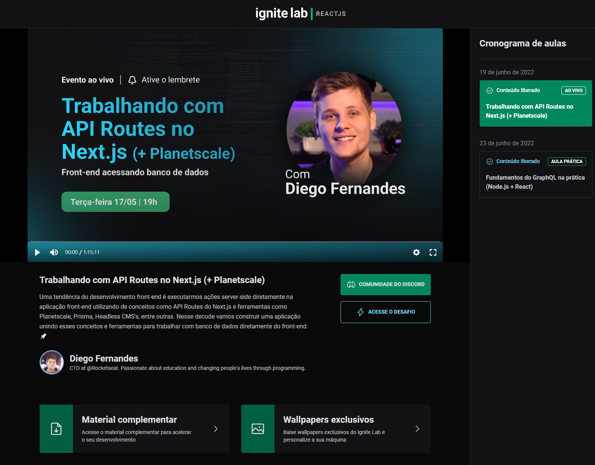

<h1 align="center">
    
</h1>

<p align="center">
 <a href="#-sobre">Sobre</a>&nbsp;&nbsp;&nbsp;|&nbsp;&nbsp;&nbsp;
  <a href="#-tecnologias">Tecnologias</a>&nbsp;&nbsp;&nbsp;|&nbsp;&nbsp;&nbsp;
  <a href="#-como-executar-o-projeto">Pré-requisitos</a>&nbsp;&nbsp;&nbsp;|&nbsp;&nbsp;&nbsp;
</p>

<p align="center">
  

  

  <a href="https://github.com/pedromiiguel/ignite-lab/commits/master">
    
  </a>

   <a href="https://github.com/pedromiiguel/ignite-lab/stargazers">
    
  </a>
</p>

<br/>

<h1 align="center">
     
</h1>

## 🚀 Tecnologias

Tecnologias utilizazadas no projeto:

- [TypeScript](https://www.typescriptlang.org/)
- [Vite](https://vitejs.dev/)
- [Tailwind](https://tailwindcss.com/)
- [Classnames](https://github.com/JedWatson/classnames)
- [Graphql](https://graphql.org/)
- [GraphqlCMS](https://hygraph.com/)
- [Graphql Code Generator](https://www.graphql-code-generator.com/)


## 🔧 Como executar o projeto

### Pré-requisitos

<p> É necessário possuir o Node.js instalado na máquina </p>
<p>E também possuir um gerenciador de tarefas NPM ou Yarn.</p>

```bash
# Clone este repositório
$ git clone https://github.com/pedromiiguel/ignite-lab.git

# Acesse a pasta do projeto no terminal/cmd
$ cd ignite-lab

# Instale as dependências
$ npm install ou yarn

# Execute a aplicação em modo de desenvolvimento
$ npm dev ou yarn dev

# O servidor inciará na porta:3000 - acesse http://localhost:3000
```

## :man_astronaut: Autor

#### Pedro Miguel

- Git Hub: <a href="https://github.com/pedromiiguel" target="_blank" >@pedromiiguel</a>
- Linkedin: <a href="https://www.linkedin.com/in/pedro-miiguel" target="_blank" >@pedromiiguel</a>
